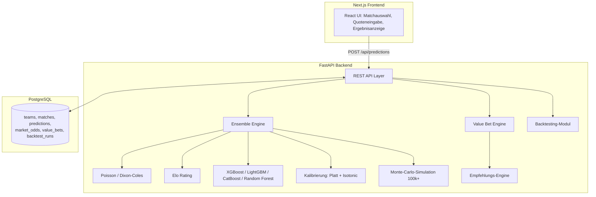
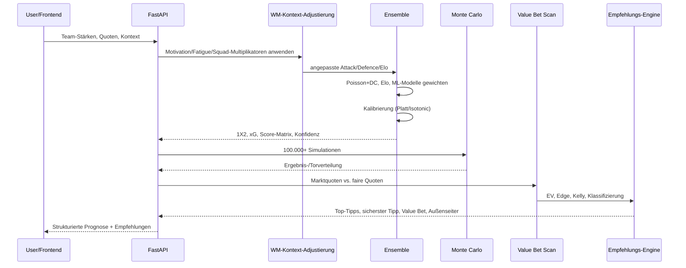

# WM Prognose Engine — Architektur

## 1. Systemarchitektur

## 2. Datenfluss pro Spiel-Prognose

## 3. Modelle und Formeln

### Poisson-Modell
P(X=k) = e^(-λ) · λ^k / k!
λ_home = Ø_Tore_Liga · Angriff_Heim · Abwehr_Gast · Heimvorteil
λ_away = Ø_Tore_Liga · Angriff_Gast · Abwehr_Heim

### Dixon-Coles-Korrektur
Reines Poisson unterschätzt Unentschieden bei niedrigen Ergebnissen, da es
Unabhängigkeit zwischen Heim- und Gasttoren annimmt. Die Korrekturfunktion
τ(x,y,ρ) passt (0,0), (1,0), (0,1), (1,1) an:
- τ(0,0) = 1 − λ_home·λ_away·ρ
- τ(0,1) = 1 + λ_home·ρ
- τ(1,0) = 1 + λ_away·ρ
- τ(1,1) = 1 − ρ

ρ wird typischerweise im Bereich [-0.15, -0.05] geschätzt (negative
Korrelation zwischen den Toren beider Teams in echten Spielen).

### Elo Rating
E_home = 1 / (1 + 10^(−(R_home − R_away + HFA)/400))
R' = R + K · g(Tordifferenz) · (tatsächlich − erwartet)

K wird je Turnierstufe gewichtet (Gruppenphase niedriger, Finale am höchsten),
g(Tordifferenz) verstärkt das Update bei höheren Siegen.

### Ensemble-Gewichtung
Gewichtetes Mittel aus Poisson/Dixon-Coles, Elo und den ML-Klassifizierern
(XGBoost, LightGBM, CatBoost, Random Forest). Initiale Gewichte sind statisch
konfiguriert; im Produktivbetrieb werden sie aus inversen Brier-Scores pro
Modell und Wettbewerb neu berechnet (bessere Modelle erhalten mehr Gewicht).

### Kalibrierung
- **Platt Scaling**: logistische Regression auf den Logits der Rohwahrscheinlichkeit,
  korrigiert systematische Über-/Unterschätzung.
- **Isotonic Regression**: monotone, nichtparametrische Anpassung — flexibler,
  benötigt aber mehr Validierungsdaten. Standardmethode in diesem Projekt.

Beide werden auf Out-of-Sample-Validierungsdaten je Outcome-Klasse trainiert.

### Value Bet Formeln
- Faire Quote = 1 / Wahrscheinlichkeit
- Implizite Quote (Markt) = 1 / Marktquote
- Edge % = (P − implizite_P) / implizite_P × 100
- Expected Value = P × Marktquote − 1
- Kelly-Anteil f* = (b·p − q) / b, mit b = Marktquote − 1, q = 1 − p
  (Standard: Quarter-Kelly zur Varianzreduktion)

### Monte-Carlo-Simulation
Aus der Dixon-Coles-Score-Matrix werden ≥100.000 Spielausgänge gezogen
(gewichtetes Sampling). Daraus: Ergebnisverteilung, Torverteilung,
Durchschnittstore, sowie K.o.-Phase-Erweiterung (Verlängerung, Elfmeterschießen).

### Backtesting-Metriken
- **Brier Score**: mean((p − outcome)²) — Kalibrierungsgüte (0 = perfekt).
- **Log Loss**: −mean(y·log(p) + (1−y)·log(1−p)) — straft übermütige Fehleinschätzungen stark.
- **Calibration Error (ECE)**: mittlere Abweichung zwischen vorhergesagter und beobachteter Häufigkeit pro Bin.
- **ROI / Yield**: Gewinn relativ zum Einsatz über alle Wetten.
- **Trefferquote**: Anteil korrekt vorhergesagter Hauptausgänge.

## 4. Wichtiger Hinweis zu Trainingsdaten

Dieses Repository enthält die vollständige Modell-, API- und Infrastruktur-
Architektur sowie alle Formeln als produktionsreifen, lauffähigen Code.
Es enthält **keine echten historischen WM-Datensätze** (2010–2022) — diese
müssen über `app/ml/train.py::load_training_data` und die Backtesting-Pipeline
eingespielt werden, bevor die ML-Komponenten (XGBoost/LightGBM/CatBoost/RF)
echte trainierte Gewichte liefern. Poisson/Dixon-Coles und Elo funktionieren
bereits vollständig mit beliebigen Team-Stärke-Eingaben (z. B. aus FIFA-Ranking,
SPI, eigenen Schätzungen).
